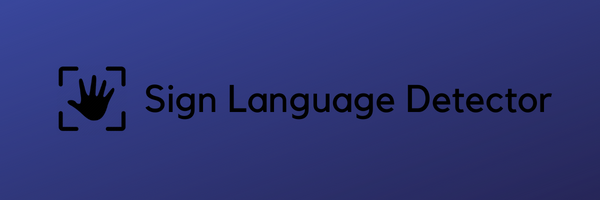
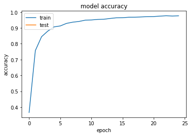
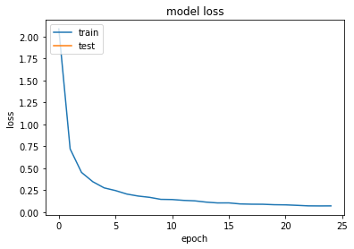

<p align="center">

</p>

<div align="center">

<strong>A python based app which can convert the hand gesture to corresponding text label in real time.</strong>
 
<a href=""></a> &nbsp;&nbsp;
<a href=""></a> 
</div>
<p align="center">

</p>

***

## Basic Overview

<p align="center"><strong>" Talk to a man in a language he understands, that goes to his head. Talk to him in his own language, that goes to his heart. "</strong></p> 
<p>This project introduces Sign Language recognition system which can recognize American Sign Language.
</p><br>
<p align="center">

</p>
<p>The project makes use of <strong>Convolutional Neural Network (CNN) Algorithm</strong> for training and to classify the images. The proposed system was able to <strong>recognize 10 American Sign gesture alphabets </strong> with high accuracy.</p>
<p>Model has achieved a remarkable <strong>accuracy of 97.89%</strong></p>
<p align="center">
&nbsp;&nbsp;

</p>

--- 

## Getting Started

It requires python version 3.6 or later as to synchronize with tensorflow.

- **collect_data.py**  file will help in creating your own dataset using webcam.

- **cnn_model.py** file will use Convolutional Neural Network (CNN) to train the model and store it in the form of hadoop distributed (h5) format.

- **gesture_predict.py** file will recognise the gesture as per the trained dataset.

- **SignDetector.py** file contains the code used to built the UI of the application.
---

## Pre-requisites

- python 3.6 or later
- tkinter module
- tensorflow
- keras
- opencv
- pillow
- numpy
- imutils
- matplotlib

---

## Installations

### 1. Install python 3 
Python is usually installed by default on most modern systems. To check what python version you currently have, open a terminal and run the following command:
```
python --version
```

   This should output some information on the installed Python version. You can also install python by following these instructions:
   [https://installpython3.com/](https://wsvincent.com/install-python/)

### 2. Install tensorflow framework

Install tensorflow framework with the following command
```
python -m pip install tensorflow --trusted-host files.pythonhosted.org --trusted-host pypi.org --trusted-host pypi.python.org
```
For upgradation use the following command

``` 
pip install tensorflow==2.0.0-alpha0
```

### 3. Install keras

Install keras with the following command
```
pip install keras
```
**Note:** if keras doesnt work just replace **keras.model** to **tensorflow.keras.model** and **keras.preprocessing** to **tensorflow.keras.preprocessing** 

### 4. Install OpenCV 

Install opencv for python with the following commands

```
pip install opencv-python==3.4.2.16
```

```
pip install opencv-contrib-python==3.4.2.16
```

### 5. Install pillow

Install PIL with the following command

```
pip install pillow
```

### 6. Install numpy 

Install numpy with the following command

```
pip install numpy
```

### 7. Install imutils 

Install imutils with the following command

```
pip install imutils
```

### 8. Install matplotlib 

Install matplotlib with the following command

```
pip install matplotlib
```

---

## How to run the project ?

There are 2 ways to run the project which are as follows:

1. You will be able to run the project by simply running the **SignDetector.py** file.

2. You will be able to execute the app by running the following command from terminal in the project directory.

<strong>On Windows:</strong>

```
.\SignDetector.bat
```

<strong>On Unix:</strong>

```
./SignDetector.sh
```
---
<p align="center">
<a href="https://git.io/typing-svg"></a></p>

---